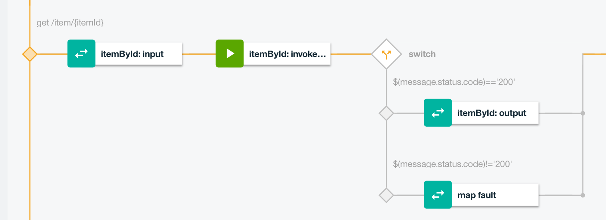
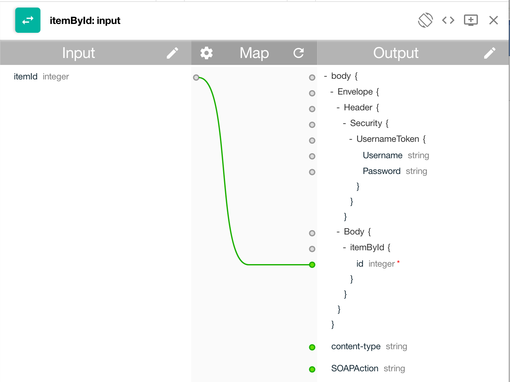
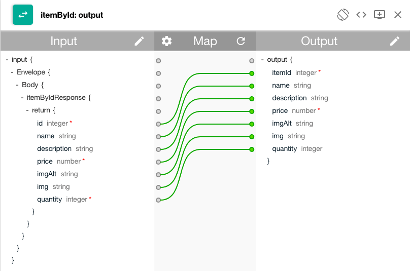

# Inventory Integration API

This project is part of the 'IBM Integration Reference Architecture' suite, available at [https://github.com/ibm-cloud-architecture/refarch-integration](https://github.com/ibm-cloud-architecture/refarch-integration)

## Goals
This project includes the definition for the inventory API and guidance on how servers are configured and API definitions are done.

The API definition exposes a set of RESTful services for managing a product inventory.
  

The API is defined and run on on-premise servers but exposed via secure connection to public cloud so born on cloud applications, like the simple [inventory app](https://github.com/ibm-cloud-architecture/refarch-caseinc-app), can leverage those APIs.

## Architecture
As illustrated in the figure below, the Inventory database is not directly accessed by application who needs it, but via a data access layer SOA service developed in Java using JAXWS.
  

With new programming model to consume RESTful API, existing SOAP interfaces need to be mapped to RESTful apis, and using a API economy paradigm, those APIs will become a product managed by IBM API connect. The *CASE Inc IT team* wants to cover their cost and exposing API may generate a revenue stream.

Born on Bluemix web apps or micro services access the exposed RESTful API using a Bluemix Secure Gateway service, which supports the API Connect destination definition. For detail on how the secure gateway was configured see [note](https://github.com/ibm-cloud-architecture/refarch-integration-utilities/blob/master/docs/ConfigureSecureGateway.md)

The diagram below presents the item/{itemid} URL as defined in API Connect  


## Server configuration
TBD

## How the SOAP interface was mapped to RESTful API
In order to map the SOAP service to a REST api, we followed the following steps:  
1) create a REST API in the API Manager UI (see tutorial here: https://www.ibm.com/support/knowledgecenter/SSMNED_5.0.0/com.ibm.apic.apionprem.doc/tutorial_apionprem_expose_SOAP.html)
2) Import the WSDL for the SOAP service in the "Services" component. This is basically an import from either a file or an url. We used the url option by pointing the dialog to on-premiseWebSphere Liberty server: http://172.16.254.44:9080/inventory/ws?WSDL.
3) Create an assembly for each of the supported REST operations:

```
          title: operation-switch
          case:
            - operations:
                - verb: get
                  path: /items
            - operations:
                - verb: get
                  path: '/item/{itemId}'
            - operations:
                - verb: post
                  path: /items
            - operations:
                - verb: put
                  path: '/item/{itemId}'
            - operations:
                - verb: delete
                  path: '/item/{itemId}'
```


 For each of these operations, there is a generated map and a invoke created by the import of the WSDL. You need to find the operation map that corresponds to the REST operation you are implementing and drop it on the canvas.

 But first you must define the "url-path" that corresponds to the SOAP operation.  
 So for example, to implement GET /items REST API, you would need to define a "Path" for "/items" first. Go over to the "assembly" tab, you'll see a default invoke policy has been defined for you for the GET /items path - delete it by hovering over the policy until a few icons appear on top of the policy. Click on the trash can icon to delete. In the assembly tab of the API Manager UI, you'll see a whole bunch of operations at the left hand bottom portion of the screen. Select "items" and drag it to the canvas. It should now look like this:
map(items:input)->invoke(items:invoke)->map(items:output)

For a get item by id the pattern is the same as illustrated in the image below:
 
 The invoke is a SOAP request (a HTTP POST)
Using the REST input parameter, itemId, we need to use it for the SOAP request itemById.id element.:


The following diagram illustrates a mapping from the SOAP response of the itemById to the JSON document of the /item/{itemId} which is part of the new exposed API.




See the completed yaml here: https://github.com/ibm-cloud-architecture/refarch-integration-api/blob/master/apiconnect/sample-inventory-api_1.0.0.yaml

## Security
The connection between the external application and API Connect Gateway is using SSL. For production environment you need to get a certificate from a certificate agency with the hostname of the API gateway server you deploy to. This certificate is used in IBM Secure gateway and any client code that needs to access the new exposed API.

## Continuous Integration
Reusing the devops approach as describe in [this asset](https://github.com/ibm-cloud-architecture/refarch-hybridcloud-blueportal-api/blob/master/HybridDevOpsForAPIC.pdf) ....

## How to leverage this asset
Using your own IBM API Connect instance import the [yaml](https://github.com/ibm-cloud-architecture/refarch-integration-api/blob/master/apiconnect/sample-inventory-api_1.0.0.yaml) delivered in this project.
