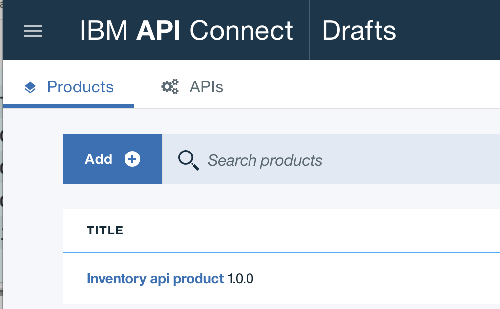
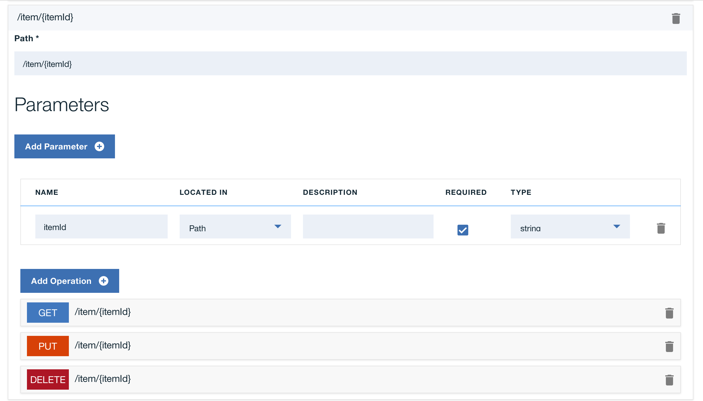
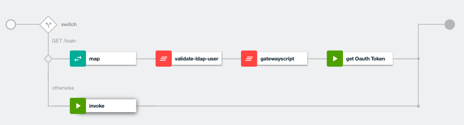

# Inventory APIs

This project is part of the 'IBM Hybrid Integration Reference Architecture' solution, available at https://github.com/ibm-cloud-architecture/refarch-integration. It addresses how we define an API product with IBM API Connect to integrate an existing SOA service for inventory management, and how to wrap a LDAP access via a `/login` url.

The focus on APIs and API management has added a consumer centric aspect to the SOA notion of interface and service contract.

## Table of Contents
* [Goals](https://github.com/ibm-cloud-architecture/refarch-integration-api#goals)
* [Architecture](https://github.com/ibm-cloud-architecture/refarch-integration-api#architecture)
* [Server configuration](https://github.com/ibm-cloud-architecture/refarch-integration-api#server-configuration)
* [Interface Mapping](https://github.com/ibm-cloud-architecture/refarch-integration-api#implementation-details)
* [Security](https://github.com/ibm-cloud-architecture/refarch-integration-api#security)
* [CI/CD](https://github.com/ibm-cloud-architecture/refarch-integration-api#continuous-integration)
* [Monitoring](https://github.com/ibm-cloud-architecture/refarch-integration-api#cloud-service-management)
* [Compendium](https://github.com/ibm-cloud-architecture/refarch-integration-api#compendium)

## Goals
This project includes the definition for the inventory APIs used by the cloud native app, CASE Inc Portal. We are summarizing how servers are configured and API definitions are done. We also detail TLS security settings.

We are defining a set of API product within the API Manager component:
* the inventory API to manage the item of the inventory. The CRU operations are defined in the product. The back end end point exists and is defined in IIB. This API product is divided into interaction API and system API.
* the supplier API to manage supplier party who deliver item to the inventory. This API is for back end, and the end point is also an IIB message flow.

The API definition exposes a set of RESTful services which are consumed by the Web App: the case portal.

The product is defined within IBM API Connect as illustrated below:

  


## Architecture
As illustrated in the figure below, the Inventory database is not directly accessed by application who needs it, but via a data access layer, SOA service, developed in Java using JAXWS and deployed on WebSphere Liberty server. The SOAP service is mapped by a gateway flow implemented in IBM Integration Bus, so API Connect can directly invoke the `gateway flow` running in IIB.

  

With the new programming model of consuming RESTful API for mobile app or web app born on cloud, existing SOAP interfaces need to be mapped to RESTful APIs, and using a API economy paradigm, those APIs will become a product managed by IBM API connect. The *CASE Inc IT team* wants to cover their cost and exposing API may generate a revenue stream, so they defined a new API for inventory management.

When born on cloud web apps or micro services are deployed to public cloud, accessing the exposed RESTful API deployed on-premise enforce using security tunneling capabilities. On IBM Bluemix the Secure Gateway service (or VPN) is used and configured to support the API Connect destination definition. For detail on how the secure gateway was configured see [note](https://github.com/ibm-cloud-architecture/refarch-integration-utilities/blob/master/docs/ConfigureSecureGateway.md)

The diagram below presents the **item/{itemid}** URL end point as defined in API Connect and that can be accessed via the secure gateway with a URL like: `https://cap-sg-prd-5.integration.ibmcloud.com:16582/csplab/sb/iib-inventory-api/item/13403`   



Here is an example of basic nodejs call that validates the integration is working:
```javascript
var options={
  url: 'https://cap-sg-prd-5.integration.ibmcloud.com:16582/csplab/sb/iib-inventory-api/items',
  hostname: 'cap-sg-prd-5.integration.ibmcloud.com',
  port: 16582,
  path: '/csplab/sb/iib-inventory-api/items',
  method: 'GET',
  rejectUnauthorized: true,
  headers: {
    'X-IBM-Client-Id': "5d2a6edb-793d-4193-b9b0-0a087ea6c123",
    'accept': 'application/json',
    'Authorization': 'Bearer '+token
  }
}
var req=request.get(
    options,
    function (error, response, body) {
    });
```

## Server configuration
A non-high availability installation consists of installing 3 virtual servers: Management (mgmt), Portal, DataPower(DP) and gateway. To support high availability, a cluster installation just adds more servers, but the basic installation is the same. To achieve high availability you’ll need at a minimum 2 mgmt servers, 2 DataPower appliances, and 3 Portal servers.
The configuration decision was to use only one server so we can quickly test resiliency and error reporting. The goal of *Hybrid integration compute* is not to validate on-premise HA, but more on the hybrid side.

After the virtual OVA files are loaded, then you can refer here for each configuration:
1. Mgmt -
https://www.ibm.com/support/knowledgecenter/en/SSMNED_5.0.0/com.ibm.apic.install.doc/overview_installing_mgmtvm_apimgmt.html
2. DP -
https://www.ibm.com/support/knowledgecenter/en/SSMNED_5.0.0/com.ibm.apic.install.doc/overview_installing_gatewayvm_apimgmt.html
3. Portal -
https://www.ibm.com/support/knowledgecenter/en/SSMNED_5.0.0/com.ibm.apic.install.doc/tapim_portal_installing_VA.html


## Implementation details

* Using the API Manager, create a product named for example **iib-inventory-api** (see tutorial here: https://www.ibm.com/support/knowledgecenter/SSMNED_5.0.0/com.ibm.apic.apionprem.doc/tutorial_apionprem_expose_SOAP.html)
 The URL is /iib-inventory-api, version 1.0.0

* Add your API to a new Product and then create the API definition

* Build a assembly like the figure below


* Specify the invoke parameters


It is possible to do the SOAP to REST mapping directly into API Connect, see [this note](docs/apic-to-soap.md) for details.

## Security
The connection between the external application and API Connect Gateway is using TLS. For production environment you need to get a certificate from a certificate agency with the hostname of the API gateway server you deploy to. This certificate is used in IBM Secure gateway and any client code that needs to access the new exposed API. See the deep dive article on [TLS for Brown compute](https://github.com/ibm-cloud-architecture/refarch-integration/blob/master/docs/TLS.md)

## Continuous Integration and Deployment
The API is defined and run on on-premise servers but exposed via secure connection to public cloud so born on cloud applications, like the simple [inventory app](https://github.com/ibm-cloud-architecture/refarch-caseinc-app), can leverage those APIs.
In fact with the release of IBM Cloud private, you can also deploy API Connect gateway on ICP, and your 'cloud native' applications or micro services on ICP too. This will simplify the integration, security settings and will leverage monitoring.

Reusing the devops approach as describe in [this asset](https://github.com/ibm-cloud-architecture/refarch-hybridcloud-blueportal-api/blob/master/HybridDevOpsForAPIC.pdf) ....

## Cloud Service management

## How to leverage this asset
Using your own IBM API Connect instance import the [yaml](https://github.com/ibm-cloud-architecture/refarch-integration-api/blob/master/apiconnect/sample-inventory-api_1.0.0.yaml) delivered in this project.

## Compendium
* [API Connect product documentation](https://www.ibm.com/support/knowledgecenter/en/SSMNED_5.0.0/mapfiles/getting_started.html)
* [Tutorial for working with API definitions that call an existing endpoint](https://www.ibm.com/support/knowledgecenter/en/SSMNED_5.0.0/com.ibm.apic.toolkit.doc/tutorial_cli_api_def_working.html)
* [Developer center](https://developer.ibm.com/apiconnect/)
