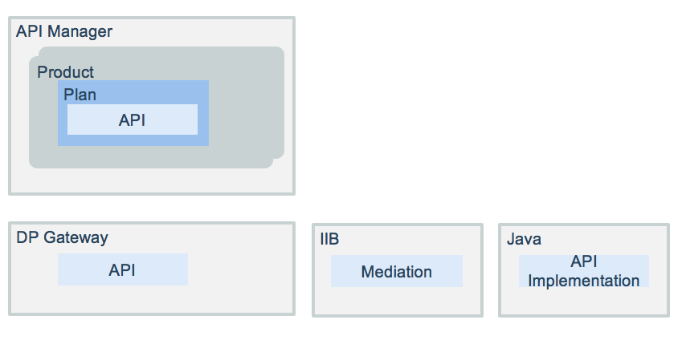

# Inventory APIs

This project is part of the 'IBM Hybrid Integration Reference Architecture' solution, available at https://github.com/ibm-cloud-architecture/refarch-integration. It addresses how we define an API product with IBM API Connect to integrate an existing SOA service for inventory management, and how to wrap a LDAP access via a `/login` uri as defined in the API product.

The focus on APIs and API management has added a consumer centric aspect to the SOA notion of interface and service contract. You can monitor the number of calls to API, control access rate and support different API versions.

## Table of Contents
* [Goals](https://github.com/ibm-cloud-architecture/refarch-integration-api#goals)
* [Architecture](https://github.com/ibm-cloud-architecture/refarch-integration-api#architecture)
* [Server configuration](https://github.com/ibm-cloud-architecture/refarch-integration-api#server-configuration)
* [Interface Mapping](https://github.com/ibm-cloud-architecture/refarch-integration-api#implementation-details)
* [Security](https://github.com/ibm-cloud-architecture/refarch-integration-api#security)
* [CI/CD](https://github.com/ibm-cloud-architecture/refarch-integration-api#continuous-integration)
* [Monitoring](https://github.com/ibm-cloud-architecture/refarch-integration-api#cloud-service-management)
* [Compendium](https://github.com/ibm-cloud-architecture/refarch-integration-api#compendium)

## Goals
This project includes the definition for the inventory APIs used by the cloud native app, CASE Inc Portal. We are summarizing how servers are configured and API definitions are done. We also detail TLS security settings.

We are defining a set of API products within the API Manager component:
* the inventory API to manage the item of the inventory. The CRU operations are defined in the product. The back end end point exists and is defined in IIB. This API product is divided into interaction API and system API.
* the supplier API to manage supplier party who deliver item to the inventory. This API is for back end, and the end point is also an IIB message flow.

API definition exposes a set of RESTful services which are consumed by the [Case Web App](https://github.com/ibm-cloud-architecture/refarch-caseinc-app).

The following diagram illustrates the API manager component used to define the product which may contain one to many plans. Plan defines the offerings on top of the APIs: for example the rate limits and cost are parameters of the offering. A plan belongs to a unique product. It may include multiple APIs, and API could be shared between product. The user can only subscribe to one Plan from a specific Product.


APIs are deployed to the gateway. The implementation of the API will be one to many backend applications. Here we present a single Java based micro service. Integration bus can be used to do interface mapping, service orchestration and mediation, in this case the API product will proxy the API to IIB mediation flow API. Within IIB the application is a REST API web service (See [IIB product documentation](https://www.ibm.com/support/knowledgecenter/SSMKHH_10.0.0/com.ibm.etools.mft.doc/bi12016_.htm)). As alternate you can develop the API implementation using the Loopback toolkit.

Products are deployed to Catalog. Consumers of the API product need to subscribe to one of the plan available to them.
In a typical configuration, an API provider organization uses a development Catalog for testing APIs under development and a production Catalog for hosting APIs that are ready for full use.

The products (inventory api product) are defined within IBM API Connect - API manager component as illustrated below:

  

API definition is done by using Swagger 2.0 specification.

## Architecture
As illustrated in the figure below, the Inventory database is not directly accessed by application who needs it, but via a data access layer, SOA service, developed in Java using JAXWS and deployed on WebSphere Liberty server. The SOAP service is mapped by a mediation flow implemented in IBM Integration Bus, so API Connect can directly invoke/ proxy this flow running in IIB.

  

With the new programming model of consuming RESTful API for mobile app or web app born on cloud, existing SOAP interfaces need to be mapped to RESTful APIs, and using a API economy paradigm, those APIs become a product managed by IBM API connect. The *CASE Inc IT team* wants to cover their cost and exposing API may generate a revenue stream, so they defined a new API for inventory management.

When cloud native web apps or micro services are deployed to public cloud, accessing the exposed RESTful API deployed on-premise enforce using security tunneling capabilities. On IBM Bluemix we have two choices: the Secure Gateway service or the VPN. For detail on how the secure gateway was configured see [note](https://github.com/ibm-cloud-architecture/refarch-integration-utilities/blob/master/docs/ConfigureSecureGateway.md)

The diagram below presents the **item/{itemid}** URL end point as defined in API Connect and that can be accessed via the secure gateway with a URL like: `https://cap-sg-prd-5.integration.ibmcloud.com:16582/csplab/sb/iib-inventory-api/v1/item/13403`   


The hostname and port number (**cap-sg-prd-5.integration.ibmcloud.com:16582**) are defined in the Secure Gateway. The URI path: `/csplab/sb` is the domain defined in the Gateway, and `iib-inventory-api/v1` is the API product name and API version.


Here is an example of basic nodejs call that validates the integration is working:
```javascript
var options={
  url: 'https://cap-sg-prd-5.integration.ibmcloud.com:16582/csplab/sb/iib-inventory-api/items',
  hostname: 'cap-sg-prd-5.integration.ibmcloud.com',
  port: 16582,
  path: '/csplab/sb/iib-inventory-api/items',
  method: 'GET',
  rejectUnauthorized: true,
  headers: {
    'X-IBM-Client-Id': "5d2a6edb-793d-4193-b9b0-0a087ea6c123",
    'accept': 'application/json',
    'Authorization': 'Bearer '+token
  }
}
var req=request.get(
    options,
    function (error, response, body) {
    });
```

## Server configuration
A non-high availability installation consists of installing 3 virtual servers: Management (mgmt), Portal, DataPower(DP) gateway. To achieve high availability you’ll need at least a minimum of 2 management servers, 2 DataPower gateways, and 3 Portal servers.

For this solution the configuration decision was to use only one server for each component so we can quickly test resiliency and error reporting. The goal of *Hybrid integration compute* is not to validate API connect on-premise HA, but more how to support hybrid end to end.

After the virtual OVA files are loaded, then you can refer here for each configuration:
1. Mgmt -
https://www.ibm.com/support/knowledgecenter/en/SSMNED_5.0.0/com.ibm.apic.install.doc/overview_installing_mgmtvm_apimgmt.html
2. DP -
https://www.ibm.com/support/knowledgecenter/en/SSMNED_5.0.0/com.ibm.apic.install.doc/overview_installing_gatewayvm_apimgmt.html
3. Portal -
https://www.ibm.com/support/knowledgecenter/en/SSMNED_5.0.0/com.ibm.apic.install.doc/tapim_portal_installing_VA.html


## Implementation details

* Using the API Manager, create a product named for example **iib-inventory-api** (see tutorial here: https://www.ibm.com/support/knowledgecenter/SSMNED_5.0.0/com.ibm.apic.apionprem.doc/tutorial_apionprem_expose_SOAP.html)
 The URL is /iib-inventory-api, version 1.0.0

* Add your API to a new Product and then create the API definition

* Build an assembly like the figure below


* Specify the invoke parameters


It is possible to do the SOAP to REST mapping directly into API Connect, see [this note](docs/apic-to-soap.md) for details.

## Security
The connection between the external application and API Connect Gateway is using TLS. For production environment you need to get a certificate from a certificate agency with the hostname of the API gateway server you deploy to. This certificate is used in IBM Secure gateway and any client code that needs to access the new exposed API. See the deep dive article on [TLS for Brown compute](https://github.com/ibm-cloud-architecture/refarch-integration/blob/master/docs/TLS.md)

## Continuous Integration and Deployment
The API is defined and run on on-premise servers but exposed via secure connection to public cloud so born on cloud applications, like the simple [inventory app](https://github.com/ibm-cloud-architecture/refarch-caseinc-app), can leverage those APIs.
In fact with the release of IBM Cloud private, you can also deploy API Connect gateway on ICP, and your 'cloud native' applications or micro services on ICP too. This will simplify the integration, security settings and will leverage monitoring.

Reusing the devops approach as describe in [this asset](https://github.com/ibm-cloud-architecture/refarch-hybridcloud-blueportal-api/blob/master/HybridDevOpsForAPIC.pdf) ....

## Cloud Service management

## How to leverage this asset
Using your own IBM API Connect instance import the [yaml](https://github.com/ibm-cloud-architecture/refarch-integration-api/blob/master/apiconnect/iib-inventory-api_1.0.0.yaml) delivered in this project.

## Compendium
* [API Connect product documentation](https://www.ibm.com/support/knowledgecenter/en/SSMNED_5.0.0/mapfiles/getting_started.html)
* [Tutorial for working with API definitions that call an existing endpoint](https://www.ibm.com/support/knowledgecenter/en/SSMNED_5.0.0/com.ibm.apic.toolkit.doc/tutorial_cli_api_def_working.html)
* [Developer center](https://developer.ibm.com/apiconnect/)
* [IBM API Connect main page](https://www.ibm.com/cloud/api-connect)
