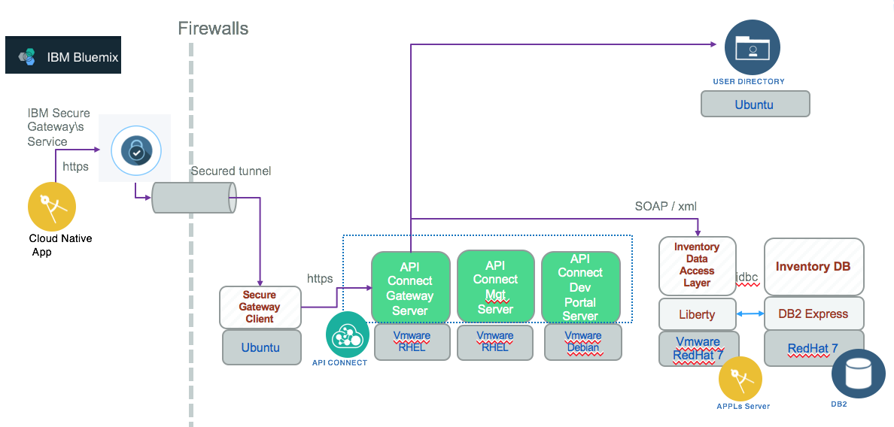

# Inventory Integration API

This project is part of the 'IBM Integration Reference Architecture' suite, available at [https://github.com/ibm-cloud-architecture/refarch-integration](https://github.com/ibm-cloud-architecture/refarch-integration)

## Goals
The API definition exposes a set of RESTful services for managing a product inventory. The API is defined and run on on-premise servers but exposed via secure connection to public cloud so born on cloud applications, like the simple [inventory app](https://github.com/ibm-cloud-architecture/refarch-inventory-app), can leverage those APIs.

## Architecture
As illustrated in the figure below, the Inventory database is not directly accessed by application who needs it, but via a SOA service data access layer developed with JAXWS.

The SOAP interface needs to be mapped to REST api, and using a API economy paradigm, this API will become a product for the CASE Inc IT team.

## How the SOAP interface was mapped to API

## Security

## Continuous Integration
Reusing the devops approach as descrive in [this asset](https://github.com/ibm-cloud-architecture/refarch-hybridcloud-blueportal-api/blob/master/HybridDevOpsForAPIC.pdf) ....

## How to leverage this asset
