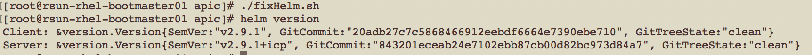

Install and configure Ceph for IBM Cloud Private
================================================

# Introduction

[Ceph](https://ceph.com/) is open source software designed to provide highly scalable object, block and file-based storage under a unified system.

Ceph provides a POSIX-compliant network file system (CephFS) that aims for high performance, large data storage, and maximum compatibility with legacy applications.

[Rook](https://github.com/rook/rook) is an open source orchestrator for distributed storage systems running in cloud native environments.

Rook turns storage software into self-managing, self-scaling, and self-healing storage services. It does this by automating deployment, bootstrapping, configuration, provisioning, scaling, upgrading, migration, disaster recovery, monitoring, and resource management. Rook uses the facilities provided by the underlying cloud-native container management, scheduling and orchestration platform to perform its duties.

**Note** The Helm chart *ibm-rook-rbd-cluster* is used for setting up Ceph Cluster in IBM Cloud Private.   

# Environment

It is presumed that IBM Cloud Private cluster is already setup and there are at least three storage worker nodes available with an additional disk of 500 GB.

IBM Cloud Private cluster configuration is listed below:

| Node type | Number of nodes | CPU | Memory (GB) | Disk (GB) |
| :---: | :---: | :---: | :---: | :---: |
|	Boot/Master	| 1	| 8	| 32 | 250 |
|	Management | 1	| 8	| 32 | 300 |
|	Proxy	| 1	| 4	| 16 | 250 |
|	Worker/Storage | 4 | 8 | 32	| 250 + 500 |
|	Total |	10	| 64| 256	| 3370 + 2000|

# Setup

This document covers the setup of *Ceph* storage using *Rook*.

The following tasks are performed for setting up the Ceph Cluster. 

1. [Download the required setup files](#1-download-the-required-setup-files)
2. [Logon to IBM Cloud Private Cluster](#2-logon-to-ibm-cloud-private-cluster)
3. [Setup Ceph Cluster](#3-setup-ceph-cluster)
4. [Verify Ceph cluster](#4-verify-ceph-cluster)
5. [Troubleshooting Ceph setup](#5-troubleshooting-ceph-setup)


### 1. Download the required setup files

**Note:** The following files are required for installing *ibm-rook-rbd-cluster* chart and setting up Ceph cluster

- [login.sh](./apic-install/login.sh) - Utility for logging onto IBM Cloud Private
- [fixHelm.sh](./apic-install/apic/fixHelm.sh) - Utility to fix default helm to add --notls flag 
- [helm](./apic-install/apic/helm) - New helm utility that appends --notls 
- [ibm-rook-rbd-cluster-0.8.3.tgz](./apic-install/charts/ibm-rook-rbd-cluster-0.8.3.tgz) - IBM Chart for Rook RBD Cluster
- [ceph-values.yaml](./apic-install/ceph/ceph-values.yaml) - Sample values.yaml for installing Ceph Cluster 
- [rook-ceph-cluster-role-binding.yaml](./apic-install/ceph/rook-ceph-cluster-role-binding.yaml) - ClusterRoleBinding for the service account rook-ceph-cluster
- [rook-ceph-operator-values.yaml](./apic-install/ceph/rook-ceph-operator-values.yaml) - Sample values.yaml for installing rook operator
- [rook-cluster-role.yaml](./apic-install/ceph/rook-cluster-role.yaml) - ClusterRole for the resource rook-privileged
- [rook-pod-security-policy.yaml](./apic-install/ceph/rook-pod-security-policy.yaml) - Define PodSecurityPolicy rook-privileged
- [setup.sh](./apic-install/ceph/setup.sh) - Utility for setting up Ceph Cluster 
- [status.sh](./apic-install/ceph/status.sh) - Utility for verifying Ceph Cluster 
- [cleanup.sh](./apic-install/ceph/cleanup.sh) - Utility for cleaning up Ceph Cluster 


### 2. Logon to IBM Cloud Private Cluster

**Step #1**  The script [fixHelm.sh](./apic-install/fixHelm.sh) can be run to enable helm to suffix **--tls** when running a command. 

The contents of the script [fixHelm.sh](./apic-install/fixHelm.sh) is as follows: 

```
#
# Run this script only once 
#

#!/bin/bash
FILE=/usr/local/bin/helmICP

if [ ! -f "$FILE" ]
then
    echo "File $FILE does not exist"
    cp /usr/local/bin/helm /usr/local/bin/helmICP
    cp ./helm  /usr/local/bin/helm
fi
```
Sample run of the fixHelm script is as follows: 




**Step #2**  The script [login.sh](./apic-install/login.sh) can be run to login to IBM Cloud Private Cluster. 

The contents of the script [login.sh](./apic-install/login.sh) is as follows: 

```
#
# UPDATE VARIABLES TO MATCH THE ENVIRONMENT
#

# Define ICP Cluster name
CLUSTER_NAME=mycluster.icp

echo 'Logging onto IBM Cloud Private CLI'
echo 
cloudctl login -a https://$CLUSTER_NAME:8443 --skip-ssl-validation

echo 'Logging onto Docker Registry'
echo 
docker login $CLUSTER_NAME:8500

echo 'Initializing Helm'
echo
helmICP init --client-only
helm version
```

**Note:**  The script should be updated to include the correct value for *CLUSTER_NAME*.

Sample run of the login script is as follows: 


### 3. Setup Ceph Cluster 

**Step #1** Update the *ceph-values.yaml*  to match the environment.

The file *ceph-values.yaml* needs to be updated to list the IP address of the storage node within the IBM Cloud Private cluster. 

```
...
...
...
#
# UPDATE VARIABLES TO MATCH THE ENVIRONMENT
#   
    nodes:
    - name: "X.X.X.X"
      devices:
      - name: "DISK_NAME"
    - name: "Y.Y.Y.Y"
      devices:
      - name: "DISK_NAME"
    - name: "Z.Z.Z.Z"
      devices:
      - name: "DISK_NAME"
...
...
...
```

**Step #2** Run the setup script to install Rook Operator chart and the IBM Rook RBD Cluster chart

The contents of the script [setup.sh](./apic-install/ceph/setup.sh) is as follows: 

```
#
# UPDATE VARIABLES TO MATCH THE ENVIRONMENT
#

# Define the location of images 
IMAGE_DIR=/DIRECTORY_HAVING_IMAGES

# Create namespaces
kubectl create namespace rook-ceph 

# Install Rook 
helmICP repo add rook-beta https://charts.rook.io/beta
helmICP search rook-ceph
helm install --name rook-ceph-v0.8.3 rook-beta/rook-ceph --version v0.8.3 -f rook-ceph-operator-values.yaml --debug --namespace rook-ceph

# Apply security policies
kubectl apply  -f rook-pod-security-policy.yaml
kubectl apply  -f rook-cluster-role.yaml
kubectl create -f rook-ceph-cluster-role-binding.yaml

echo "Waiting for the pods to come up"
sleep 2m
./status.sh

# Install Ceph cluster 
helm install --name ibm-rook-rbd-cluster-v0.8.3 -f ceph-values.yaml $IMAGE_DIR/ibm-rook-rbd-cluster --debug --namespace rook-ceph
```

**Note:**  The script should be updated to include the correct location for *IMAGE_DIR* that has the location where the chart [ibm-rook-rbd-cluster-0.8.3.tgz](./apic-install/charts/ibm-rook-rbd-cluster-0.8.3.tgz) is downloaded and unzipped. 

The output of Ceph install is listed below for reference: 
 
- [ceph_install.log](./apic-install/samples/ceph_install.log)


### 4. Verify Ceph cluster

The script [status.sh](./apic-install/ceph/status.sh) can be run to check if Ceph cluster is working as expected. 

The contents of the script [status.sh](./apic-install/ceph/status.sh) is as follows: 

```
# Get status 
kubectl get pods -n rook-ceph 
kubectl get jobs -n rook-ceph 
``` 

Expected output is listed below. 


### 5. Troubleshooting Ceph setup

#### 5.1 Steps for reseting an used disk 

It is possible that sometimes OSD pods does't start up even though the OSD prepare jobs have completed successfully. 
It could happen when the device you have specified does not have a raw disk and the device name you have listed was used for other storage like GlusterFS cluster.

In such case the following commands can be run to collect the Logical Volume group ID and Physical volume and remove it fully so that the raw disk is made available for the Ceph cluster.

```
pvs
pvdisplay
vgremove LOGIOCAL_VOLUME_GROUP_ID -y 
pvremove PHYSICAL_VOLUME
```

The output of the aforesaid commands is listed below.

```
[root@rsun-rhel-glusterfs03 ~]# pvs
  PV         VG                                  Fmt  Attr PSize   PFree  
  /dev/sda2  rhel                                lvm2 a--   39.00g      0 
  /dev/sdb   vg_687894352b254c630b291bf094a8d43d lvm2 a--  499.87g 499.87g
  /dev/sdc   rhel                                lvm2 a--  500.00g      0 
[root@rsun-rhel-glusterfs03 ~]# pvdisplay
  --- Physical volume ---
  PV Name               /dev/sdb
  VG Name               vg_687894352b254c630b291bf094a8d43d
  PV Size               500.00 GiB / not usable 132.00 MiB
  Allocatable           yes 
  PE Size               4.00 MiB
  Total PE              127967
  Free PE               127967
  Allocated PE          0
  PV UUID               v6xOuh-M2ot-oXfl-IWyf-TnYL-nX3a-kzqizN
   
  --- Physical volume ---
  PV Name               /dev/sda2
  VG Name               rhel
  PV Size               39.00 GiB / not usable 3.00 MiB
  Allocatable           yes (but full)
  PE Size               4.00 MiB
  Total PE              9983
  Free PE               0
  Allocated PE          9983
  PV UUID               tNjUif-RlBT-kdDn-PWwE-LHlq-3w9O-65Hlph
   
  --- Physical volume ---
  PV Name               /dev/sdc
  VG Name               rhel
  PV Size               500.00 GiB / not usable 4.00 MiB
  Allocatable           yes (but full)
  PE Size               4.00 MiB
  Total PE              127999
  Free PE               0
  Allocated PE          127999
  PV UUID               7CXpz5-95hb-0WAC-3Efe-XrY1-s6E6-dqLasC
   
[root@rsun-rhel-glusterfs03 ~]# vgremove vg_687894352b254c630b291bf094a8d43d -y 
  Volume group "vg_687894352b254c630b291bf094a8d43d" successfully removed
[root@rsun-rhel-glusterfs03 ~]# pvremove /dev/sdb 
  Labels on physical volume "/dev/sdb" successfully wiped.
```

#### 5.2 Steps for uninstalling the rook-ceph setup 

**Step #1** The script [cleanup.sh](./apic-install/ceph/cleanup.sh) can be run to remove the Ceph setup completely.

The contents of the script [cleanup.sh](./apic-install/ceph/cleanup.sh) is as follows: 

```
# Delete the Helm Chart 
helm delete ibm-rook-rbd-cluster-v0.8.3 --purge 
sleep 1m
helm delete rook-ceph-v0.8.3 --purge 
sleep 1m

# Delete the policies
kubectl delete -f rook-ceph-cluster-role-binding.yaml
kubectl delete -f rook-cluster-role.yaml
kubectl delete -f rook-pod-security-policy.yaml

# Delete namespaces
kubectl delete namespace rook-ceph
``` 

**Step #2** Remove the contents of the temporary directory used by rook: */var/lib/rook*

The following command should run on all the worker nodes: 

```
rm -fr /var/lib/rook
```