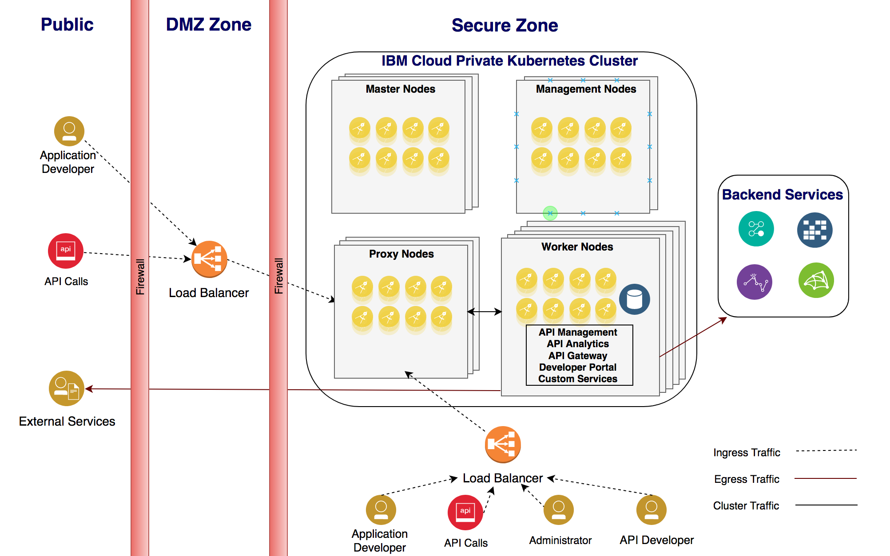
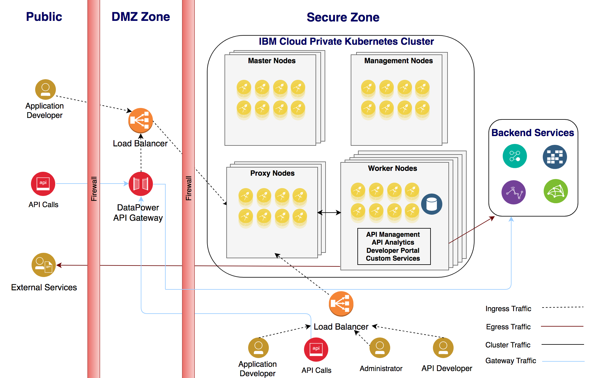

# IBM API Connect Workload on IBM Cloud Private

IBM API Connect provides a complete solution for managing APIs in the enterprise. It provides framework for exposing APIs hosted by the custom services running in IBM Cloud Private and/or backend services running on traditional systems.

IBM API Connect provides value-add by providing additional security for the exposed APIs and also provides a framework for collecting analytics.

# Topology

IBM API Connect v2018.x installation allows to install the following four main components.

1. **API Management** - This component is the central coordinator or “brain” of the whole solution for IBM API Connect
2. **API Analytics** - This component is built on-top of the Elastic Stack and manages API Event logs to provide analytics
3. **API Portal** - This component provides framework through which APIs can be socialized to application developers.
4. **API Gateway** - This component handles the core runtime and is responsible for responding to incoming API calls from the applications.

When setting up IBM API Connect on IBM Cloud Private the following two options are possible.

**Option #1:** Install all components of IBM API Connect in IBM Cloud Private. 

This option is commonly use when the DataPower Physical Appliances are not already available in the enterprise.

The following topology diagram illustrates the topology for this option.

**Option #2:** Use External IBM DataPower appliance for API Gateway component.

In this option, the components *API Management*, *API Analytics* and *API Portal* are installed in IBM Cloud Private. The existing DataPower appliances are used to handle the run-time API Gateway traffic.

The following topology diagram illustrates the topology for this option.

# Capacity Planning

### Installation Mode

IBM API Connect can be installed in one of the following two modes. 

* **dev** - In this mode only one instance of the subsystem is created with with no clustering capabilities. This is best suited for Development (non-HA) environment. 
* **standarad** - This mode allows three instances of each subsystem is created with clustering capabilities. This is best suited for Production-like (HA) environment. 

### Storage 

IBM API Connect requires **block storage** for handling persistant data. **GlusterFS** is not recommended as a storage option due to severe performance degradation. Also, API Connect v2018 cannot be deployed on **NFS**. 

**Ceph RBD Cluster** is used as reference block storage provider in IBM Cloud Private. 

### System resources
 
A typical IBM Cloud Private Environment includes Boot node, Master node, Management node, Proxy node and Worker nodes. When the Ceph RBD Cluster is used for providing storage for API Connect, any three worker nodes should be configured to have additional raw disks.

The following set of systems can be used as reference for building *development (non-HA) environment* that runs IBM API Connect workload on IBM Cloud Private.

| Node type | Number of nodes | CPU | Memory (GB) | Disk (GB) |
| :---: | :---: | :---: | :---: | :---: |
|	Boot (FTP Server) | 1	| 8	| 32 | 2048 |
|	Master	| 1	| 8	| 32 | 300 |
|	Management | 1	| 8	| 32 | 300 |
|	Proxy	| 1	| 4	| 16 | 300 |
|	Worker | 3 | 8 | 32	| 300+500(disk2)|
|	Total |	7 | 52 | 208 | 3848+1500(disk2) |

The following set of systems can be used as reference for building *production (HA) environment* that runs IBM API Connect workload on IBM Cloud Private.

| Node type | Number of nodes | CPU | Memory (GB) | Disk (GB) |
| :---: | :---: | :---: | :---: | :---: |
|	Boot (FTP Server)	| 1	| 8	| 32 | 2048 |
|	Master	| 3	| 8	| 32 | 300 |
|	Management | 2	| 8	| 32 | 300 |
|	Proxy	| 3	| 4	| 16 | 300 |
|	Worker  | 3 | 16 | 64 | 300+750(disk2)|
|	Total |	12	| 108| 432 | 5348+2250(disk2) |

**NOTE:** Additional worker nodes will be required when there is a a need to run workloads other than IBM API Connect on IBM Cloud Private.

# Install and Configure IBM API Connect

The document [Install Ceph for ICP.md](./Install%20Ceph%20for%20ICP.md) can be used as the guide for installing and configuring **IBM Rook RBD cluster**.

The document [Enable APIC in ICP.md](./Enable%20APIC%20in%20ICP.md) can be used as the guide for installing **IBM API Connect v2018.4.1** on **IBM Cloud Private V3.1**
